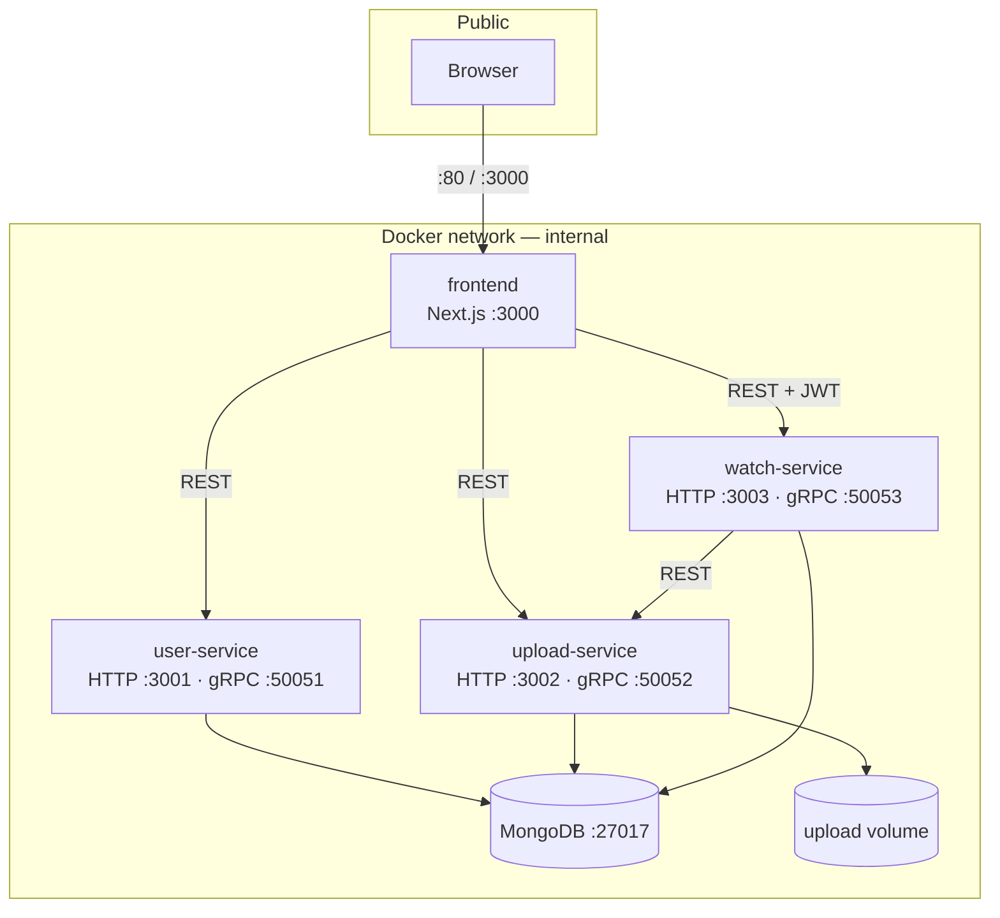
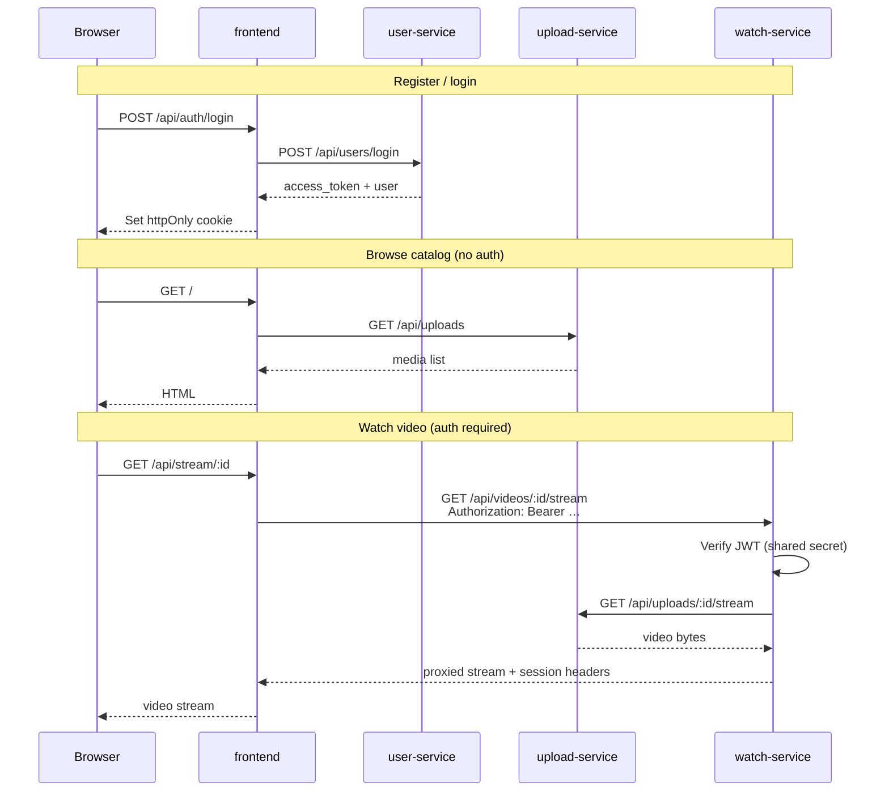

# Movie Microservice

A full-stack video/music platform built as **independently deployable microservices** plus a Next.js frontend. Users register and log in, upload media, browse a catalog, and watch videos with resume progress — each concern lives in its own service with its own database.

## What it does

| Capability | Service |
|------------|---------|
| Register, login, JWT auth | **user-service** |
| Upload video/music, store files, stream media | **upload-service** |
| Browse videos, watch with auth, save progress | **watch-service** |
| Web UI + BFF API routes | **frontend** (Next.js) |

Each backend service exposes **HTTP REST** (primary, used by frontend and other services) and **gRPC** (same business logic, for tooling or future clients). Services do not share code or a monolithic database.

---

## Architecture



**Production:** only the frontend port is published to the internet (`:80`). Backend services talk over the Docker network. **Local dev compose** also exposes backend ports for Postman and debugging.

### Databases (database-per-service)

| Service | MongoDB database | Owns |
|---------|------------------|------|
| user-service | `user_service` | users, hashed passwords |
| upload-service | `upload_service` | media metadata |
| watch-service | `watch_service` | watch sessions, progress |

File bytes live on disk (`upload_data` volume) or, later, S3 — metadata stays in upload-service’s DB.

---

## Service-to-service communication

All runtime traffic between components is **HTTP REST**. gRPC ports are available on each service but are not used for inter-service calls today.



### Communication matrix

| From | To | Protocol | Purpose |
|------|-----|----------|---------|
| **frontend** | user-service | HTTP | Register, login, profile (`/api/users/*`) |
| **frontend** | upload-service | HTTP | List/browse media, audio streams |
| **frontend** | watch-service | HTTP | Video streams (JWT forwarded) |
| **watch-service** | upload-service | HTTP | List videos, metadata, fetch file stream |
| **user-service** | watch-service | — | No direct calls |
| **user-service** | watch-service | JWT | Shared `JWT_SECRET` — watch-service validates tokens issued by user-service |

### Auth model

1. **user-service** signs JWTs on login (`JWT_SECRET`, `JWT_EXPIRES_IN`).
2. **watch-service** verifies the same secret on protected routes (`Authorization: Bearer <token>`).
3. **frontend** stores the token in an **httpOnly cookie** and forwards it when streaming video.
4. **upload-service** has no auth (uploads are open; lock down in production if needed).

---

## Project layout

```
microservice/
├── services/
│   ├── user-service/       # Auth + users (HTTP + gRPC)
│   ├── upload-service/     # Media upload + storage (HTTP + gRPC)
│   └── watch-service/      # Video watching + progress (HTTP + gRPC)
├── frontend/               # Next.js app (UI + /api/auth/* BFF routes)
├── deploy/
│   ├── EC2.md              # Single-host production guide
│   ├── VAULT.md            # Optional HashiCorp Vault secrets
│   └── ec2-setup.sh        # Bootstrap script
├── docker-compose.yml      # Local dev (all services + Mongo)
├── docker-compose.prod.yml # Production stack (+ frontend)
├── .env.production.example
└── package.json            # Optional compose helper scripts
```

Each service folder is a **complete deployable app**:

- `proto/` — gRPC contract for that service
- `src/` — handlers, services, repositories, Winston logger (`src/lib/logger/`)
- `Dockerfile`, `package.json`, `.env.example`, `README.md`

No shared npm package. Copy any `services/<name>/` folder to its own repo without sibling dependencies.

---

## Ports and APIs

| Component | HTTP | gRPC | Notes |
|-----------|------|------|-------|
| user-service | `3001` | `50051` | [README](services/user-service/README.md) |
| upload-service | `3002` | `50052` | [README](services/upload-service/README.md) |
| watch-service | `3003` | `50053` | [README](services/watch-service/README.md) |
| frontend | `3000` (dev) / `80` (prod) | — | [frontend/](frontend/) |
| MongoDB | `27017` | — | Internal only in production |

### HTTP highlights

| Service | Key routes |
|---------|------------|
| user-service | `POST /api/users/register`, `POST /api/users/login`, `GET /api/users/profile` |
| upload-service | `POST /api/uploads`, `GET /api/uploads`, `GET /api/uploads/:id/stream` |
| watch-service | `GET /api/videos/latest`, `GET /api/videos/:id/stream` (auth), `PATCH …/progress` |
| frontend | `POST /api/auth/login`, `GET /api/stream/:id` (proxies upstream) |

gRPC RPCs mirror the same operations — see each service’s `proto/` file.

---

## Tech stack

| Layer | Technology |
|-------|------------|
| Runtime | Node.js 18+ |
| HTTP | Express |
| RPC | gRPC (`@grpc/grpc-js`) |
| Database | MongoDB + Mongoose |
| Auth | JWT (`jsonwebtoken`), bcrypt |
| Uploads | Multer, pluggable storage (local / S3 stub) |
| Logging | Winston (JSON in production) |
| Frontend | Next.js (App Router), TypeScript |
| Containers | Docker, Docker Compose |

---

## Quick start

### Option A — full stack with Docker (recommended)

```bash
# From repo root
docker compose up -d --build
```

Services start on `3001`–`3003` and gRPC `50051`–`50053`. MongoDB on `27017`.

Run the frontend separately (see Option C) or add it to compose for a complete UI.

### Option B — production-like stack locally

```bash
cp .env.production.example .env   # set JWT_SECRET
docker compose -f docker-compose.prod.yml up -d --build
```

App at **http://localhost** (port 80). Upload API exposed on `3002` for Postman.

### Option C — frontend dev server

Backend must be running (Option A or individual services).

```bash
cd frontend
cp .env.local.example .env.local
npm install
npm run dev
```

Open **http://localhost:3000**.

### Option D — one service alone

```bash
cd services/user-service
cp .env.example .env    # set MONGO_URI
npm install
npm run dev
```

Rebuild only what changed:

```bash
cd services/user-service
npm run docker:build
# redeploy user-service image — other services unchanged
```

---

## Environment variables

### Root / production (`.env` for `docker-compose.prod.yml`)

| Variable | Required | Description |
|----------|----------|-------------|
| `JWT_SECRET` | Yes | Same value for user-service and watch-service |
| `JWT_EXPIRES_IN` | No | Default `7d` |
| `LOG_LEVEL` | No | Default `info` |
| `FRONTEND_PORT` | No | Default `80` |
| `UPLOAD_PORT` | No | Default `3002` (public upload API) |
| `USER_MONGO_URI` | No | Defaults to built-in `mongodb` container |
| `UPLOAD_MONGO_URI` | No | Same |
| `WATCH_MONGO_URI` | No | Same |
| `STORAGE_PROVIDER` | No | `local` (default) or `s3` |
| `MAX_FILE_SIZE_MB` | No | Default `500` |

Per-service variables are documented in each `services/*/README.md` and `.env.example`.

---

## Production deployment

```bash
cp .env.production.example .env
# Edit JWT_SECRET (and optional Atlas URIs)
docker compose -f docker-compose.prod.yml up -d --build
```

| Guide | Description |
|-------|-------------|
| [deploy/EC2.md](deploy/EC2.md) | Full EC2 + Docker Compose walkthrough |
| [deploy/VAULT.md](deploy/VAULT.md) | Load secrets from HashiCorp Vault |

**Security group:** expose `80` (and `22` for SSH). Do not expose MongoDB or internal API ports.

---

## Logging

All backend services use [Winston](https://github.com/winstonjs/winston):

- **Development** — colored, human-readable lines with timestamps and service name
- **Production** (`NODE_ENV=production`) — one JSON object per line (Docker, CloudWatch, Datadog, etc.)
- **HTTP requests** — method, path, status, duration (health checks at `debug` level)
- **Errors** — stack traces on unhandled HTTP/gRPC errors and process crashes

| Variable | Default | Description |
|----------|---------|-------------|
| `NODE_ENV` | unset | Set to `production` for JSON logs |
| `LOG_LEVEL` | `info` (prod) / `debug` (dev) | `error`, `warn`, `info`, `debug` |

### Reading logs in Docker

**Use `docker compose logs`, not the bare service name with `docker logs`.**

Compose service names (`user-service`) are not the same as container names (`watchify-user-service-1`). The compose command resolves the right container for you.

```bash
# Recommended — works with service names
docker compose -f docker-compose.prod.yml logs -f user-service

# See all running containers and their real names
docker compose -f docker-compose.prod.yml ps

# If you use docker logs, you need the NAME column from docker ps:
docker logs -f watchify-user-service-1
```

If logs are empty, check the container is actually running:

```bash
docker compose -f docker-compose.prod.yml ps -a
docker compose -f docker-compose.prod.yml logs --tail=50 user-service
```

After pulling logging fixes, rebuild images:

```bash
docker compose -f docker-compose.prod.yml up -d --build
```

You should see JSON lines like `{"level":"info","message":"Starting service",...}` on startup.

Local dev stack:

```bash
docker compose logs -f
docker compose logs -f user-service
docker compose logs -f --tail=100 upload-service
```

Production stack:

```bash
docker compose -f docker-compose.prod.yml logs -f watch-service
```

Production logs are JSON — pipe through `jq`:

```bash
docker compose -f docker-compose.prod.yml logs --no-log-prefix user-service | jq .

docker compose -f docker-compose.prod.yml logs --no-log-prefix user-service \
  | jq 'select(.level == "error")'

docker compose -f docker-compose.prod.yml logs --no-log-prefix upload-service \
  | jq 'select(.message == "HTTP request" and .durationMs > 500)'
```

Raise verbosity: set `LOG_LEVEL=debug` in `.env`, then `docker compose -f docker-compose.prod.yml up -d`.

---

## Independent deployment

Each service is designed to ship on its own:

| Service | Optional own repo | Own CI | Own image tag |
|---------|-------------------|--------|---------------|
| user-service | `user-service.git` | `ci/user.yml` | `user-service:1.2.0` |
| upload-service | `upload-service.git` | `ci/upload.yml` | `upload-service:2.0.1` |
| watch-service | `watch-service.git` | `ci/watch.yml` | `watch-service:1.0.3` |

### API contract note

`.proto` files are **duplicated per service on purpose**. If you change a public gRPC API, update that service’s `proto/` and redeploy **only that service**. HTTP route changes follow the same rule. Clients must use a matching contract version.

When deploying services separately, keep these cross-service settings aligned:

- `JWT_SECRET` — user-service and watch-service
- `UPLOAD_SERVICE_URL` — watch-service must reach upload-service HTTP
- Frontend `*_SERVICE_URL` env vars — must point to reachable backends

---

## Further reading

- [user-service README](services/user-service/README.md) — auth API, env vars
- [upload-service README](services/upload-service/README.md) — upload formats, storage
- [watch-service README](services/watch-service/README.md) — watch flow, progress API
- [deploy/EC2.md](deploy/EC2.md) — production on AWS EC2
- [deploy/VAULT.md](deploy/VAULT.md) — secrets management
